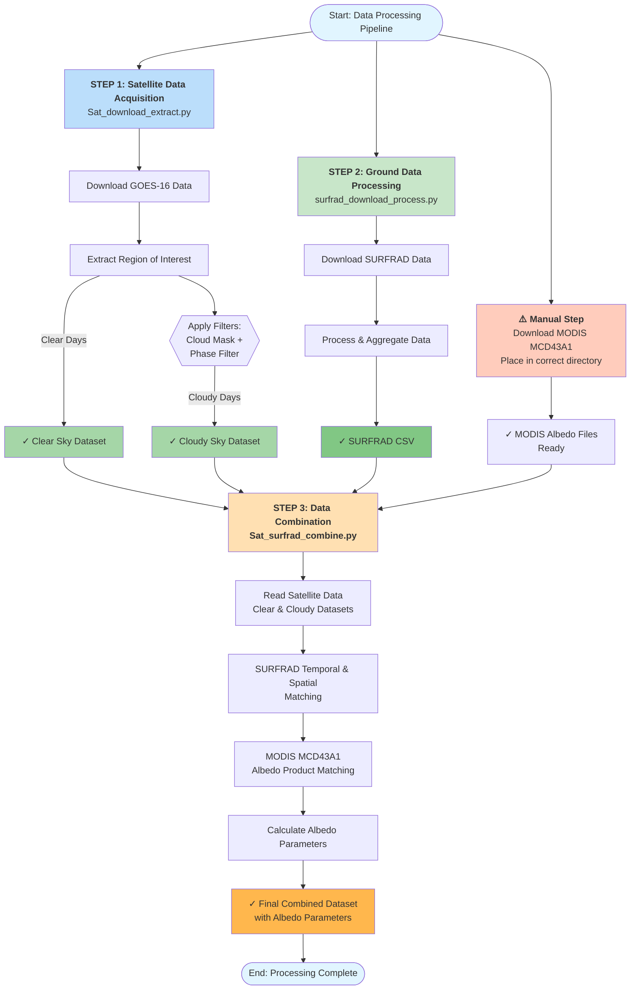

# **Satellite & Ground Data Processing Pipeline**

Nan DENG dengnan987@gmail.com

This document outlines the three-step workflow for downloading, processing, and combining GOES-16 satellite data, SURFRAD ground observations, and MODIS albedo products.

## **Pipeline Overview**

### Step 1: Satellite Data Acquisition & Extraction

**Script Name:** Sat\_download\_extract.py

This script handles the initial retrieval of satellite imagery and separates useful data based on atmospheric conditions.

* **Function 1: Download GOES-16**  
  * Retrieves GOES-16 data from the source.  
* **Function 2: Extract Region**  
  * Clips data to the specific region of interest.  
  * **Filtering:** Applies filters to categorize data into:  
    * Clear days  
    * Cloudy days (utilizing Cloud Mask \+ Phase Filter).

---

### Step 2: Ground Data Processing

**Script Name:** surfrad\_download\_process.py

This script manages the ground-truth data from SURFRAD stations.

* **Function 1: Download and Process**  
  * Downloads raw SURFRAD data.  
  * Processes and aggregates the data into a single, consolidated CSV file for easy matching.

---

### Step 3: Data Combination & Albedo Calculation

**Script Name:** Sat\_surfrad\_combine.py

This final script merges the satellite and ground data and incorporates surface albedo parameters.

* **Function 1: Read Satellite Data**  
  * Ingests the processed GOES-16 radiance data from Step 1\.  
* **Function 2: Match with Ground Data**  
  * Aligns satellite observations with SURFRAD ground data (temporal and spatial matching).  
* **Function 3: Load & Calculate Albedo**  
  * Loads the **MODIS MCD43A1** albedo product.  
  * Calculates the following albedo parameters:  
    * Black-sky albedo  
    * White-sky albedo  
    * Blue-sky albedo

**⚠️ Important Notes**

* **Manual Download Required:** The **MODIS MCD43A1** product cannot be downloaded automatically by these scripts. It requires a handy (manual) download at [here](https://ladsweb.modaps.eosdis.nasa.gov/missions-and-measurements/science-domain/brdf-albedo-and-nbar/) prior to running Step 3\. Ensure these files are placed in the correct directory before execution.

## Flow chart

