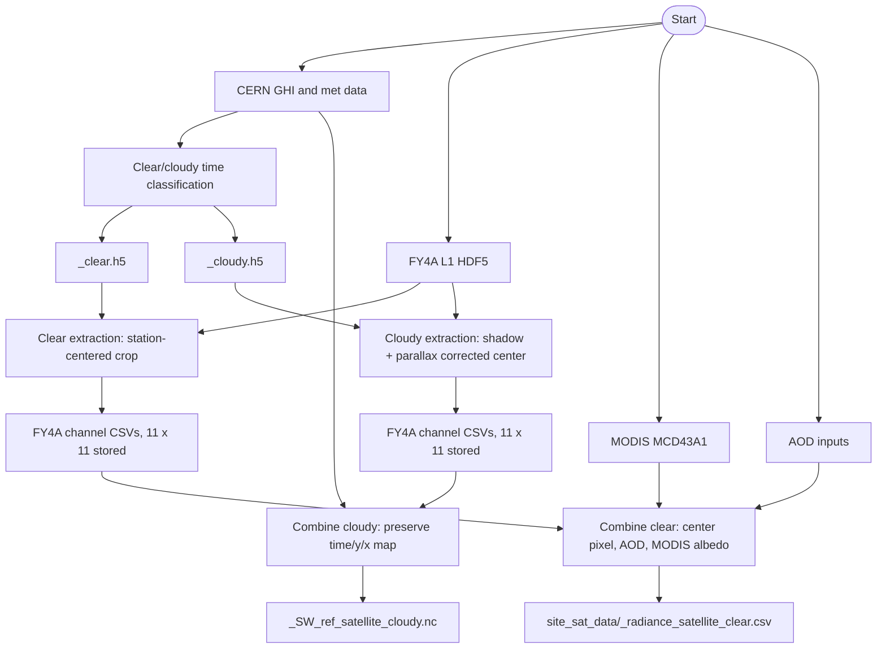

# FY4A Satellite and Ground Preprocessing Pipeline

Nan DENG (dengnan987@gmail.com)

This document describes the FY4A/CERN preprocessing workflow used to prepare
clear-sky center-pixel cases and cloudy 2D-map cases for shortwave validation
and cloudy retrieval experiments.

## Pipeline Overview

### Step 1: FY4A Extraction and Ground Sky Classification

Script: `FYSat_remap_and_ground_preprocess.py`

Inputs:

- FY4A L1 full-disk HDF5 files under `FY_L1_2021/`
- CERN site metadata: `../FY4A_data/CERN_info.csv`
- CERN hourly GHI: `CERN_instGHI_2021_UTC.csv`

Ground preprocessing:

- `clearsky_filter()` classifies CERN GHI into clear and cloudy periods.
- It writes:
  - `Ground/preprocessed_GHI/<SITE>_clear.h5`
  - `Ground/preprocessed_GHI/<SITE>_cloudy.h5`
  - `Ground/preprocessed_GHI/<SITE>_consistent_clear_days.h5`

Satellite extraction:

- Clear-sky extraction uses the station-centered FY4A crop.
- Cloudy extraction applies GOES-style geometry correction to the crop center:
  - cloud shadow displacement from solar zenith/azimuth
  - satellite parallax displacement from FY4A satellite zenith/azimuth
  - fixed cloud-top height: `cth_km = 2.0`
- After the corrected cloudy center is found, the script still extracts the
  same FY4A 11 x 11 map around that center.
- The extraction format is unchanged: each channel is saved as a CSV with
  columns `0..120`, one row per timestamp.

Important cloudy assumption:

- FY4A currently has no cloud phase mask in this workflow.
- Therefore cloudy extraction keeps all cloud types selected by the ground
  cloudy-time classification. No water/ice phase filtering is applied.

Output examples:

- `cropped_FY2021_clear/<SITE>/<SITE>_Channel01.csv`
- `cropped_FY2021_cloudy/<SITE>/<SITE>_Channel01.csv`
- geometry and angle channels are saved in the same per-site/per-channel format.

### Step 2: Data Combination

Script: `Data_combine_FY_SW.py`

Inputs:

- FY4A cropped channel CSVs from Step 1
- CERN GHI and meteorological variables
- MODIS MCD43A1 BRDF/albedo tables under `mcd43a1_albedo/data/`
- AOD inputs from `AOD_correction/`

Clear-sky behavior:

- `sky = 'clear'`
- `extract2D = False`
- The script reads the center pixel from each FY4A 11 x 11 crop.
- It combines FY4A reflectance, ground variables, AOD, and MODIS albedo into
  site CSV outputs under `../FY4A_data/site_sat_data/`.

Cloudy behavior:

- `sky = 'cloudy'`
- `extract2D = True`
- The script preserves the full FY4A 11 x 11 map with dimensions
  `(time, y, x)`.
- It attaches 1D ground variables such as `RH`, `T_s`, and `GHI` along the
  `time` dimension.
- The output is NetCDF:
  - `../FY4A_data/<SITE>_SW_ref_satellite_cloudy.nc`

The cloudy NetCDF path intentionally preserves 2D spatial structure. Do not
replace it with center-pixel extraction.

### Step 3: MODIS Albedo Handling

`Data_combine_FY_SW.py` loads both available MCD43A1 tables:

- `CERN2021-MCD43A1-061-results.csv`
- `CERN34-MCD43A1-061-results.csv`

The script concatenates these files before filtering by site category. If a
site has no matching valid MODIS rows, the satellite and ground rows are
preserved with NaN albedo columns instead of dropping the entire site.

## Known Missing CERN GHI Inputs

The following sites do not currently have usable GHI input for preprocessing:

- `DTL`: not found in `CERN_instGHI_2021_UTC.csv`
- `ALF`, `DYB`, `GGF`, `HBG`, `QYF`, `SPD`, `SYA`, `TYA`: columns exist, but
  GHI values are NaN or nonpositive.

These are upstream ground-data gaps, not downstream FY4A extraction failures.

## Clear vs Cloudy Summary

| Case | Extraction center | Spatial output | Combine output |
| --- | --- | --- | --- |
| Clear | Station center | center pixel used in combine | CSV |
| Cloudy | shadow + parallax corrected center, `cth_km = 2.0` | full 11 x 11 map | NetCDF |

## Flow Chart

